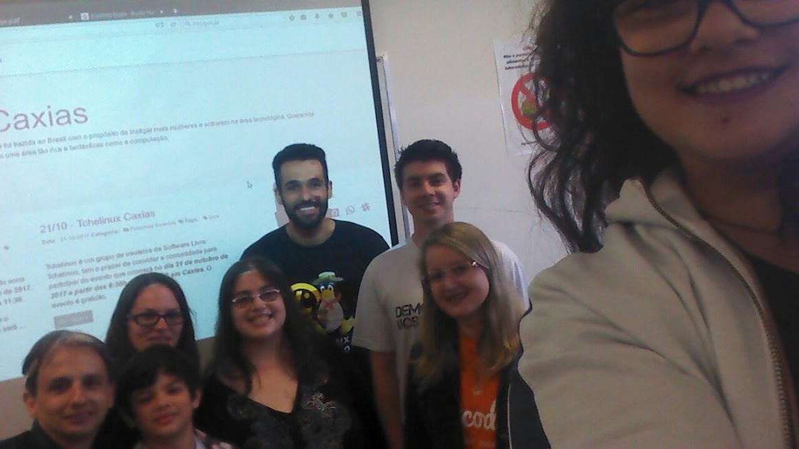

:title: Encontro de Outubro 2017
:description: Encontro mensal PyLadies Caxias do Sul
:date: 2017-10-07 21:45:28
:category: Eventos
:tags: eventos

:slug: encontro-de-outubro

:event-start: 2017-10-07 9:30
:event-duration: 3h
:event-end:  2017-10-07 12:00
:location: UCS - Universidade de Caxias do Sul
:summary: No dia 07 de outubro de 2017 o PyLadies Caxias do Sul realizou seu encontro mensal. Não pode articipar do nosso encontro, mas ficou curiosa para saber o que rolou? Não tem problema!

No dia 07 de outubro de 2017 o PyLadies Caxias do Sul realizou seu encontro mensal. Não pode participar do
nosso encontro, mas ficou curiosa para saber o que rolou? Não tem problema, nós contamos tudo para você!

Nós aproveitamos a oportunidade para definirmos detalhes dos próximos eventos que iremos participar:
* 21 de Outubro - `Tchelinux Caxias <https://caxias.tchelinux.org/>`_
O TcheLinux é um grupo que ajuda a divulgar o Software Livre e busca levar o conhecimento à todos os
cantos do Rio Grande do Sul!

Nesse evento estaremos divulgando o PyLadies Caxias do Sul, distribuindo adesivos e tirando dúvidas, então fique a vontade para vir falar conosco.
* 18 de novembro de 2017 - PyCaxiasDay
O PyCaxiasDay é um grupo de programadores python da região da serra gaúcha.

Neste evento falaremos um pouco sobre o Framework de desenvolvimento web Django. Esse framework é usado nos oficinas Django Girls que são organizadas pelas PyLadies.

Falando em Django Girls!!

Também falamos um pouco sobre as próximas oficinas que estamos organizando:

* 19 de maio de 2018 - `Django Girls Bento Gonçalves <https://www.facebook.com/djangogirlsbento/>`_

* Setembro de 2018 (data à definir) - `Django Girls Caxias do Sul <https://www.facebook.com/djangogirlscaxiasdosul/>`_

Se interessou em participar? Então fique atenta a nossa página no `facebook <https://www.facebook.com/pyladiescaxias/>`_ para não perder nenhuma novidade.

Ficaremos muito felizes com a sua presença! <3
